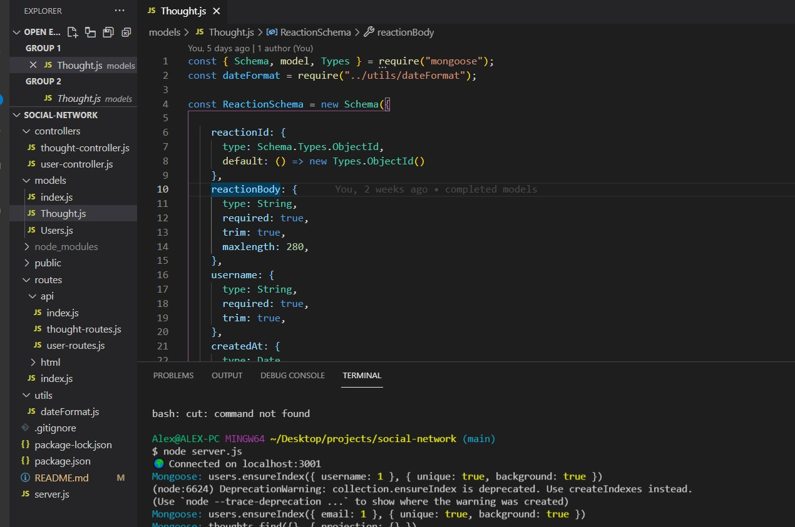

# Challenge 18 - Social Network NoSQL Challenge

## Purpose
To build an API for a social network web application where users can share their thoughts, react to friends’ thoughts, and create a friend list using Express.js for routing, a MongoDB database, and the Mongoose ODM.

## Built With
* JavaScript
* Insomnia
* MongoDB
* Express.js
* Node.js
* APIs

## Github Link
https://github.com/christenson10/social-network.git
## Video Link
https://youtu.be/tUqKQL01SzQ

## README Preview 1
File Structure Example

## README Preview 2
Code Example
